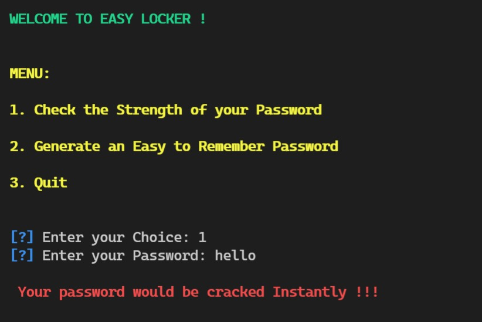
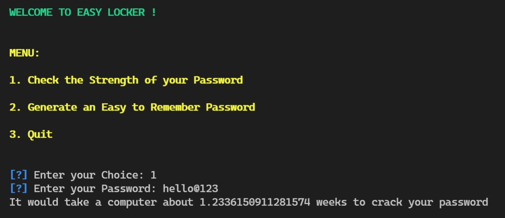
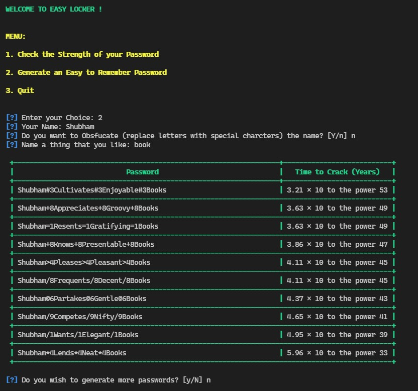

# EasyLocker

A Password Security Interface





## Description

EasyLocker is a password security interface which enables users to check the strength of their passwords and also to generate easy to remember passwords with high strength. It checks for both Brute Force and Dictionary attacks for password breaking.

## Salient features:

1. Password Strength Checker
2. User friendly, Easy to remember passwords
3. Colorful Interface

## This Application is made using:

1. Python
2. Datamuse API (https://www.datamuse.com/api/)

## To run the repository on the system:

1. Clone the repository using "git clone https://github.com/tiwarishubham635/EasyLocker.git"
2. Run the command

```
python EasyLocker.py
```
